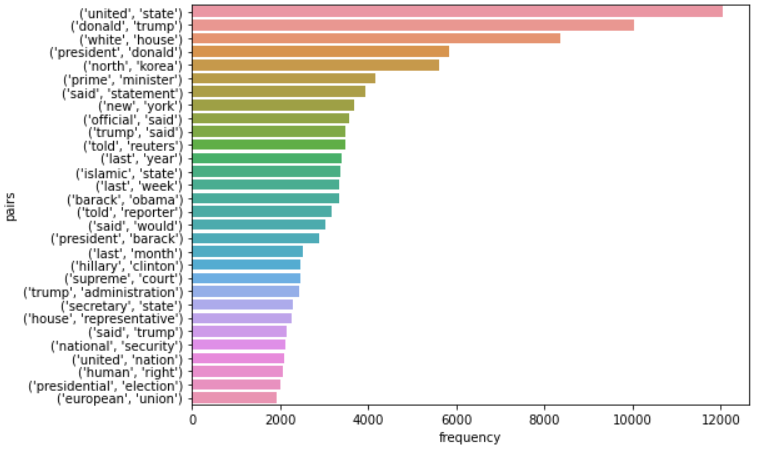
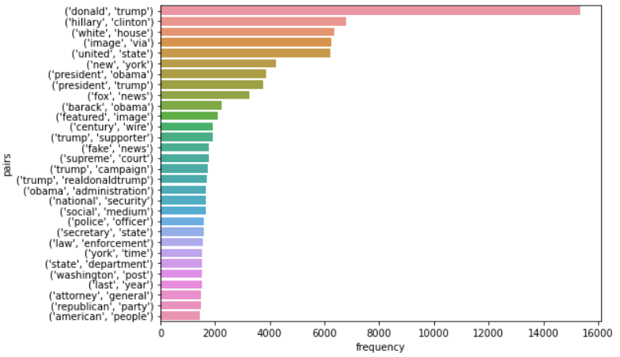
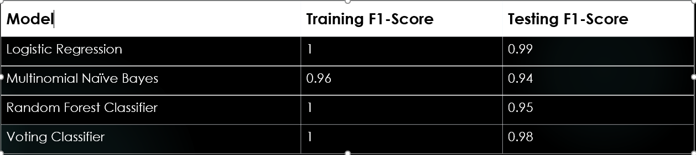
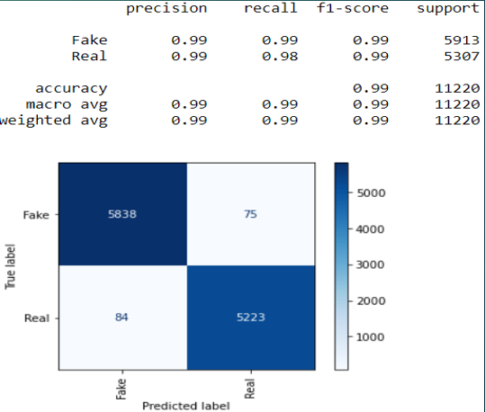
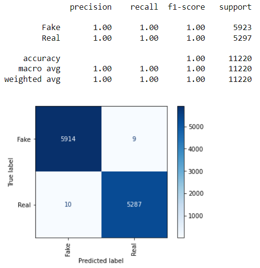

# Fake-News-Identification-System

### Project Overview

The goal of this project is to create a fake new identification system using natural language processing (NLP). My data set consists of over 40 thousand articles obtained from Kaggle. 
A variety of machine learning models have been used to generate the best results.

### Business Case

Over the course of the past decade, the amount of fake news being shared on social media has seen a dramatic increase. According to NewsGuard, 
"in 2019, 8 percent of engagement with the 100 top-performing news sources on social media was dubious. 
In 2020, that number more than doubled to 17 percent" ([Vox](https://www.vox.com/policy-and-politics/2020/12/22/22195488/fake-news-social-media-2020)). 
In 2021, the Daily Wire, the outlet founded by right-wing comentator Ben Shapiro, was the most popular news platform on Facebook.

From casting doubts on the results of the 2020 presidential election to spreading misinformation about the COVID vaccine, fake news is causing real damage to our society.

Because the main source of fake news is social media sites, such as Facebook and Twitter, 
I set out to produce a fake news identification system that can be used by social media companies to filter out minsinformation. 
A altnerative use of this system could be a web app with which users can verify the authenticity of a story themselves.

### The Repo

All of the data cleaning, exploratory analysis and modeling can be found in the 'Capstone-Final-Version' notebook. Each section of the notebook is labelled. 
In addition to this, the code for a web app using Streamlit can be found in the 'webapp.py' notebook.

### The Data

For this project, I used the 'Fake and Real News Dataset' from Kaggle.

The dataset contained 21,417 real articles from Reuters and 23,481 fake articles from various sources.

These articles spanned a period of time from January 2017 to december 2017

### Data Cleaning

The model is only looking at the text of the articles, not the titles, subject or date.

The only cleaning step required was to remove the names of the news outlet and city of origin from the real articles.

No cleaning was required with the fake articles.

### Data Preparation

I used SpaCy to tokenize the text of the articles and remove stop words, upper case letters and punctuation as well as to lemmatize the words in the articles.

### Exploratory Data Analysis

In addition to SpaCy, I used NLTK to perform my exploratory data analysis.

I used word clouds and frequency distribution tables to analyze the text from the real and fake articles.

Real Articles:

Fake Articles:

The frequency distribution tables looked at unigrams, bi-grams and tri-grams.

Real Article Trigrams:

Fake Article Trigrams:

Former President trump was at the top of the list int he frequency distribution tables for both the real and fake articles.

However, the real articles tended to have more of a focus on international events, international leaders and US government officials, 
while the fake articles had more of a focus on domestic events and individuals such as Hillary Clinton, 
former President Barack Obama as well as right wing talking points such as the New York Times, fake news and Black Lives Matters.

### Modeling

I used the F1 score as the main evaluation metric from this project since I was not overly concerned with false positives or negatives.
I applied Logistic Regression, Multinomial Naive Bayes, a Random Forest Classifier and a Voting Classifier to the processed data. 
The best results were shown by Logistic Regression and Voting Classifier. 
The following table shows the performance of the four models. 
For Logistic Regression and Multinomial Naive Bayes, I used both siple pipelines and pipelines combined with gridsearch to generate the best results.

I achieved my best results with Logistic Regression combined with Gridsearch. 
This model had little over fitting, however the F1 score is extremely high, indicating that perhaps the model needs to be trained on a wider variety of articles, spanning a longer period of time.
The Confusion Matrix below shows that the models are able to separate the real and fake classes from my data set very well.

Logistic Regression

Voting Classifier

### Conclusion

This project shows that NLP can be used to differentiate between real and fake news articles. Four different Machine Learning Models were used to process the data. 
Logistic Regression provided the best results with an f1 score of 0.99. The model had little over fitting, however, the f1 score is extremely high, 
indicating that perhaps the model needs to be trained on a wider variety of articles, spanning a longer period of time.

### Future Work

Here are some steps I can take to further develop this project

<ul>
<li>Collect more articles from different sources spanning a longer period of time.</li>